## 核心结论

端到端 ConvSNN 在 PlantVillage 38 类独立测试集上取得 90.61% 准确率；引入实测电导曲线、差分电导映射和离散脉冲写入后，硬件感知准确率为 81.19%。依据 38 类硬件感知模型在选择验证集上的类别召回率重新选出 Top-10，并从头训练新的 10 输出模型。Top-10 理想与硬件感知准确率分别为 97.67% 和 93.85%。

硬件感知结果是使用实测电流—电导数据约束权重更新的仿真结果，不等同于芯片实测部署结果，也不用于推算缺少测量依据的能耗或面积。

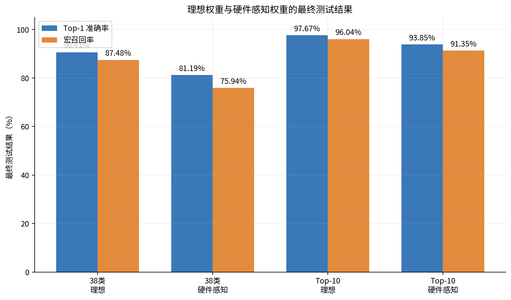

## 1. 数据集与评估协议

PlantVillage 包含健康叶片和多种植物病害。原训练目录共有 43,444 张图像，按固定随机种子分为 36,927 张训练图像和 6,517 张选择验证图像；原 `val` 目录的 10,861 张图像完整保留为 38 类最终测试集。Top-10 最终测试集包含 4,894 张图像。

选择验证集负责调参、早停、最佳 checkpoint 和 Top-10 排名。最终测试集只在全部选择冻结后使用。类别数量不均衡，因此同时报告总体准确率和对每个类别等权的宏召回率。

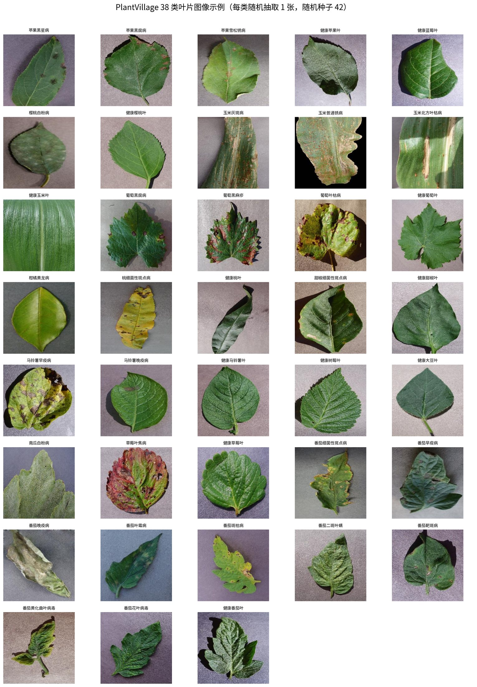

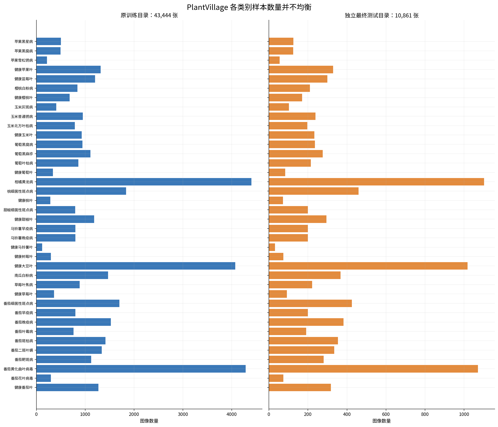

## 2. ConvSNN 与 LIF 时间计算

当前模型不是普通 CNN 编码器后接一个 SNN 分类头。三层卷积和两层全连接的每个可学习阶段均接入 LIF 脉冲神经元。RGB 像素作为第一层的直接输入电流，在 8 个时间步内重复输入；第一层 LIF 之后传递脉冲。输出类别由 8 步累计输出脉冲数最大者确定，每个批次开始前清空膜电位。

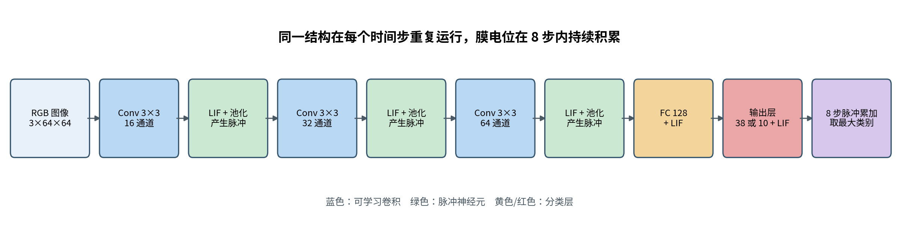

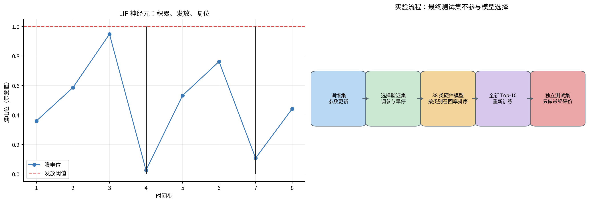

## 3. 实测器件数据怎样进入训练

实测 CSV 在固定偏压下记录电流。电流除以偏压绝对值得到电导，相邻电导的上升与下降分别形成 LTP 和 LTD 经验更新曲线。LTP 可理解为器件电导逐步增强，LTD 可理解为电导逐步减弱。

单个器件只能表达正电导，因此一个有符号软件权重由 `G+` 和 `G-` 两个器件组成，权重正比于两者差值。反向传播给出目标变化后，查找表选择有限个 LTP/LTD 脉冲，更新实际电导，再同步回网络权重。卷积和全连接权重进入映射；偏置、批归一化状态及固定 LIF 参数仍保持理想数值。

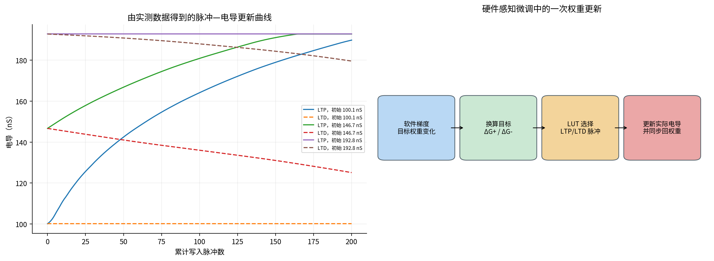

## 4. 训练与模型选择

38 类理想训练最多运行 100 epochs，实际运行 100 epochs，最佳 checkpoint 为 Epoch 82。新 Top-10 名单与历史名单相比替换了 3 个类别，因此没有复用旧模型，而是训练全新的 10 输出网络；实际运行 56 epochs，最佳 checkpoint 为 Epoch 36。

硬件搜索只读取训练集和选择验证集。两个任务最终均选择学习率 0.02、每次更新最多 4 个脉冲。38 类硬件模型最佳 Epoch 为 1，Top-10 硬件模型最佳 Epoch 为 3。

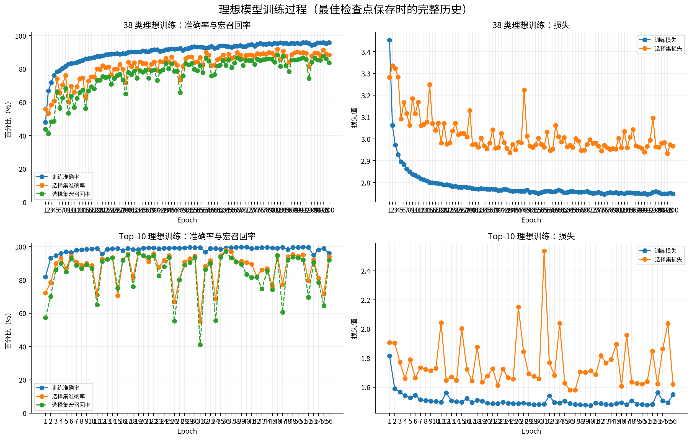

## 5. 最终测试结果

| 任务 | 权重形式 | 测试样本 | Top-1 准确率 | 宏召回率 | 最佳 Epoch | 写入脉冲 |
|---|---|---:|---:|---:|---:|---:|
| 38 类 | 理想 | 10,861 | 90.61% | 87.48% | 82 | — |
| 38 类 | 硬件感知 | 10,861 | 81.19% | 75.94% | 1 | 8791 |
| Top-10 | 理想 | 4,894 | 97.67% | 96.04% | 36 | — |
| Top-10 | 硬件感知 | 4,894 | 93.85% | 91.35% | 3 | 51958 |

38 类从理想到硬件感知下降 9.42 个准确率百分点和 11.55 个宏召回率百分点。Top-10 对应下降 3.82 和 4.69 个百分点。两组正式硬件模型的电导饱和率均接近零，性能下降主要来自初始电导映射、离散写入和非线性更新，而不是大量器件卡在上下限。

## 6. 38 类逐类表现

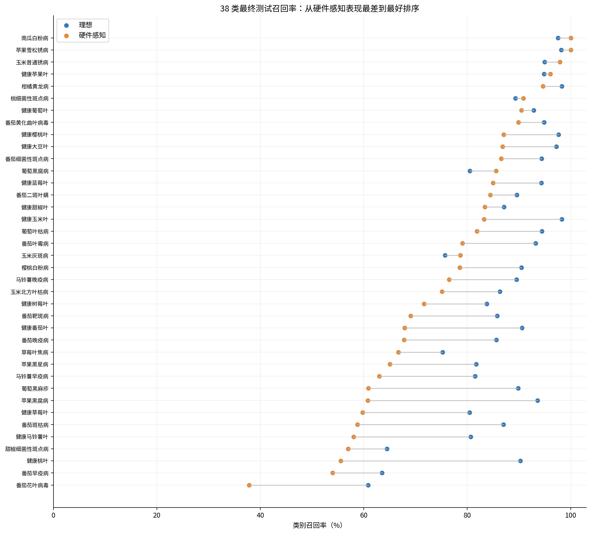

硬件模型表现最弱的类别如下。总体准确率明显高于宏召回率，说明少数困难类别仍会被总体数字掩盖。

| 类别 | 测试样本 | 召回率 | 精确率 |
|---|---:|---:|---:|
| 番茄花叶病毒 | 74 | 37.84% | 100.00% |
| 番茄早疫病 | 200 | 54.00% | 87.80% |
| 健康桃叶 | 72 | 55.56% | 95.24% |
| 甜椒细菌性斑点病 | 200 | 57.00% | 98.28% |
| 健康马铃薯叶 | 31 | 58.06% | 94.74% |
| 番茄斑枯病 | 354 | 58.76% | 80.00% |

## 7. 新 Top-10 任务

新 Top-10 完全由 38 类硬件感知 selection recall 确定，并按 precision 和类别名称处理并列；final-test 不参与排序。

1. 南瓜白粉病（原始索引 25）
2. 玉米普通锈病（原始索引 8）
3. 柑橘黄龙病（原始索引 15）
4. 健康葡萄叶（原始索引 14）
5. 健康苹果叶（原始索引 3）
6. 桃细菌性斑点病（原始索引 16）
7. 苹果雪松锈病（原始索引 2）
8. 健康樱桃叶（原始索引 6）
9. 健康大豆叶（原始索引 24）
10. 番茄黄化曲叶病毒（原始索引 35）

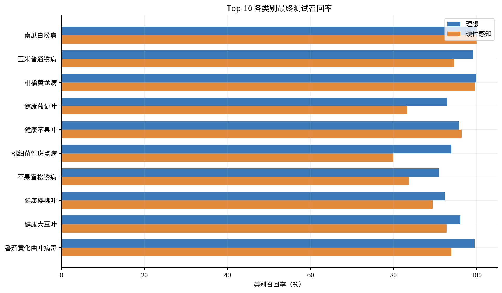

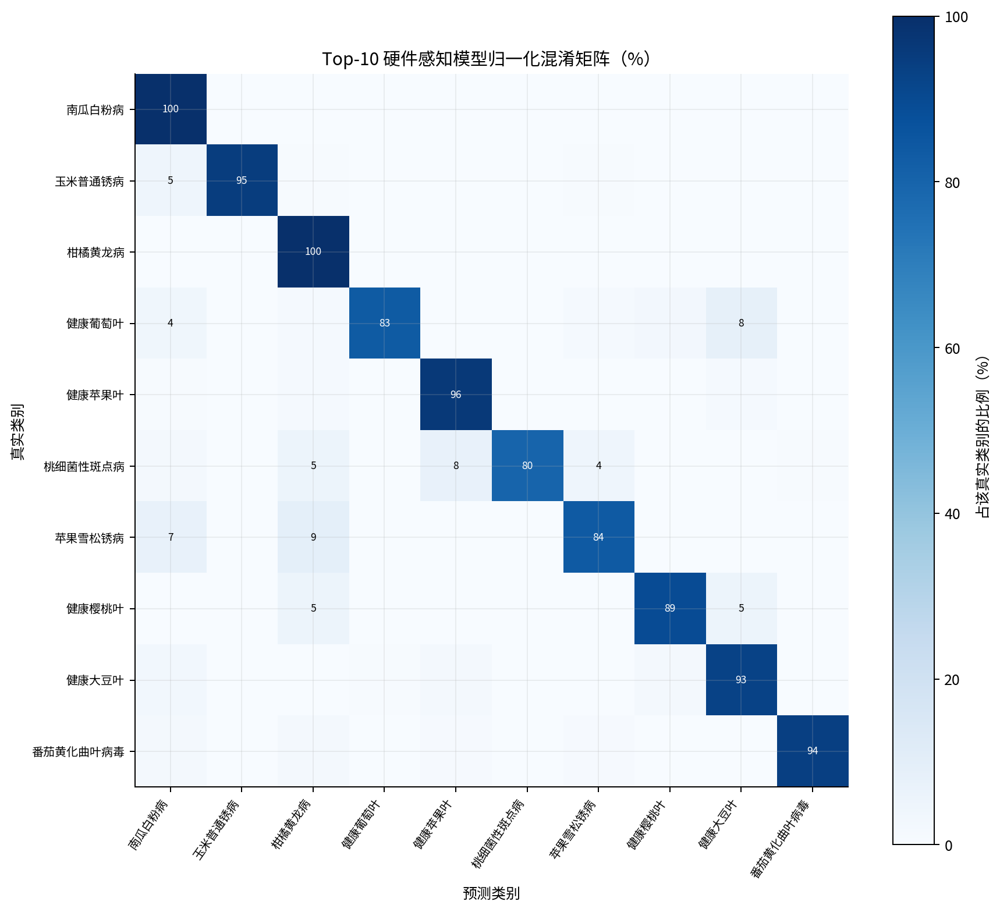

## 8. 时间行为、内部活动与样本

8 个时间步的累计准确率持续上升，说明最终预测利用了真实的时间累积过程。逐层放电率用于检查网络是否完全沉默或异常饱和，不保存全部原始激活张量。

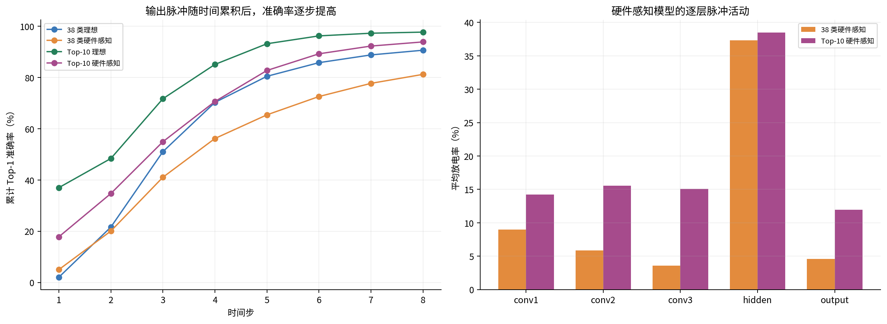

下图按照输出脉冲领先差值选择高置信正确与高置信错误样本。“最好”和“最坏”描述模型置信行为，不代表图像质量。

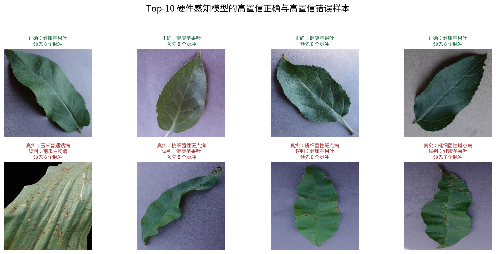

## 9. 限制与结论

当前输入为重复的 RGB 直接电流，不是事件相机异步脉冲。实测器件 CSV 缺少逐次光刺激同步日志，因此经验 LUT 保留了电导非线性和方向差异，但仍需后续器件实验确认真实脉冲条件。批归一化、偏置和 LIF 参数尚未映射到器件。

结果表明，延长训练显著改善了 38 类理想 ConvSNN；器件约束会造成可测量的性能损失，但新 Top-10 硬件模型仍保持 93.85% 最终准确率。后续重点应放在减小初始电导映射损失、改善困难类别和验证真实光感器件接口。
