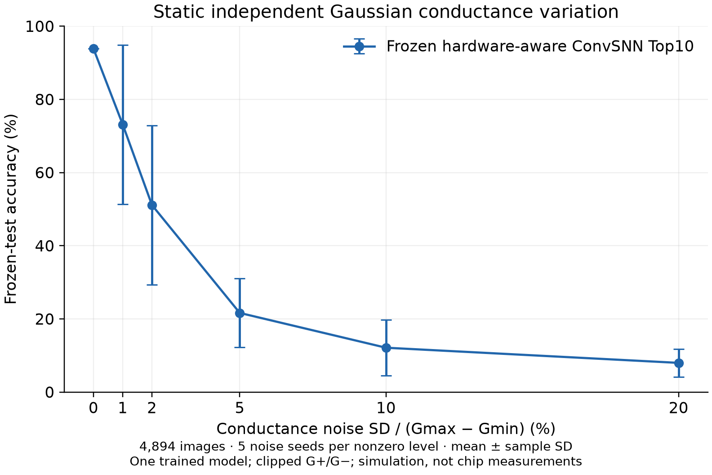

# ConvSNN Top10：电导扰动鲁棒性与原模型权重

本目录补充已发表仓库结果中 **93.8496% 硬件感知 ConvSNN Top10** 的电导扰动评估。使用同一个冻结模型和原来的 4,894 张测试图片，不重新训练，不用扰动结果选模型。所有非零扰动点来自实际模型推理；这是实测电导范围约束的**仿真实验**，不是在真实芯片上注入噪声的测量。

配套汇报：[六页 PDF、Typst 源文件与独立交付核验](../../reports/project-update/README.md)。

## 评估结果

原 GPU 环境下，零扰动的 **4,894 张逐图预测全部与原记录一致**（4,593 张正确）。完成 26 次全量推理，结果如下；± 后为样本标准差，单位为百分点。

| 电导扰动 σ | 测试准确率（均值 ± 标准差） | 次数 |
|---|---:|---:|
| 0% | 93.85% | 1 |
| 1% | 73.12% ± 21.76 | 5 |
| 2% | 51.10% ± 21.81 | 5 |
| 5% | 21.63% ± 9.41 | 5 |
| 10% | 12.12% ± 7.60 | 5 |
| 20% | 7.98% ± 3.79 | 5 |



该模型在此静态、独立、加性扰动定义下明显敏感；不能据无扰动的 93.85% 推断具有良好电导鲁棒性。五个噪声种子的波动较大，应连同原始重复结果和误差条一起报告。类别不均衡，严重退化时总体准确率可能低于 10%，因此同时保留宏召回率与完整混淆矩阵。

## 扰动定义

对每个卷积层和全连接层的每个差分电导单元分别采样：

```text
G'± = clip(G± + σ × (Gmax − Gmin) × ε±, Gmin, Gmax)
ε+、ε− ~ N(0, 1)，各物理单元独立
w' = 原层 scale × (G'+ − G'−) / (Gmax − Gmin)
```

横轴 σ 是**电导量程归一化的噪声标准差**：1% 表示噪声标准差为整个电导量程的 1%，不等同于每个电导值的 1%，也不等同于权重的 1%。电导范围为 `Gmin=1.0014012e-7 S`、`Gmax=1.9276658e-7 S`。

每次试验从原始 G+/G− 恢复，采样一次电导误差，并在该次全部测试图片与全部时间步中保持固定；不同强度使用相同 seed 配对标准正态样本。越界值裁剪至电导上下界，并逐次报告裁剪比例。偏置、BatchNorm 和 LIF 参数保持原值。这模拟静态单元差异，不包含随时间变化的读噪声、温度漂移或重新校准。

预设强度为 `0, 0.01, 0.02, 0.05, 0.10, 0.20`，非零强度使用 `100,101,102,103,104` 五个噪声种子。标准差为这五次准确率的**样本标准差（ddof=1）**，不是五次重新训练的标准差，也不是置信区间。零扰动只计算一次，绘图误差条记为 0。

## 文件与单位

- `summary.csv`：每个扰动强度的测试准确率均值、样本标准差及宏召回率均值；绘图首选。
- `repeat_metrics.csv`：每次试验的正确数、样本数、准确率、宏召回率、裁剪比例与耗时。
- `confusion_sigma*_seed*.json`：对应试验的混淆矩阵，行是真实类别、列是预测类别。
- `protocol.json`：运行状态、基线核对、噪声定义、版本、种子、源码与结果校验值。
- `environment.json` / `requirements.txt`：执行环境及依赖版本快照。
- `accuracy_vs_conductance_noise.png` / `.svg`：均值 ± 样本标准差曲线，无插值样本或平滑拟合。
- [model/manifest.json](model/manifest.json)：原始训练 checkpoint 与交付文件 SHA-256。
- [model/checkpoint.pt](model/checkpoint.pt)：原模型的可移植推理权重，约 4.2 MiB。
- [model/test_manifest.json](model/test_manifest.json)：冻结测试图片的相对路径、标签、原预测及逐图 SHA-256。
- [model/device.csv](model/device.csv)：原始器件曲线输入。

CSV 中准确率、标准差和 σ 均为 **0–1 比例**。绘制百分比时乘以 100。图片需自行放到 `data/val/<类别>/`，不随本目录分发。仅绘图不需要图片或 PyTorch。

## 权重来源

源实验为 `artifacts/hardware_refresh_2026-08-06/final/conv_snn_top10_hw_finetune_seed42/best.pt`，最佳 epoch 为 3。原始文件 SHA-256：

```text
0372bb4754c53a1d16ddd8b300c65d7b8efec0a65e07722cacab6d3292623de9
```

交付文件保留原 `model_state`、差分电导 G+/G−、层 scale 和必要配置。模型张量与电导数组已逐项精确核对；没有重新训练或重新量化。为便于移植，移除了原机绝对路径前缀、优化器、随机数状态与训练历史，将 NumPy 数组转为张量，可用 `torch.load(..., weights_only=True)` 读取。因此交付文件不是训练 checkpoint 的逐字节副本，二者文件哈希不同。

## 复现

从仓库根目录，在有 NVIDIA GPU 的环境运行。实验脚本先校验权重、器件数据及所有测试图片的 SHA-256，然后要求零扰动逐张预测与原记录一致；若不一致则明确退出，不把不同基线接入原曲线。

```bash
python -m venv .venv
source .venv/bin/activate
python -m pip install torch==2.11.0 torchvision==0.26.0 --index-url https://download.pytorch.org/whl/cu130
python -m pip install -e ./convsnn numpy==2.4.3 snntorch==0.9.4
python -m plantvillage_snn.robustness \
  --bundle results/convsnn10_robustness/model --data-root data \
  --output artifacts/convsnn10_robustness_replay --device cuda \
  --sigmas 0 0.01 0.02 0.05 0.10 0.20 --seeds 100 101 102 103 104
```

`--output` 必须是新目录，以免覆盖已有数据。只核对基线可加 `--sigmas 0`。CPU 或不同计算库可能在脉冲阈值附近产生预测差异；原 GPU 基线是复核依据。

如需锁定全部依赖，可在 Python 3.11 环境中执行 `python -m pip install -r results/convsnn10_robustness/requirements.txt`，再安装项目包。此次运行使用 RTX 4060 Laptop GPU、PyTorch 2.11.0+cu130、NumPy 2.4.3、snnTorch 0.9.4。此前 CPU 核查得到 93.7883%，有 5 张预测不同，已由基线检查拒绝，未用于本曲线。

直接从已发布 CSV 重画：

```bash
python -m pip install matplotlib
python tools/plot_convsnn10_robustness.py --results results/convsnn10_robustness
```

原工程持有者可重新导出权重，普通接收者直接使用 `model/` 即可：

```bash
python tools/export_convsnn10_checkpoint.py --source-root ORIGINAL_PROJECT \
  --output artifacts/convsnn10_delivery_reexport
python -m pytest -q convsnn/tests/test_robustness.py convsnn/tests/test_device.py
```
