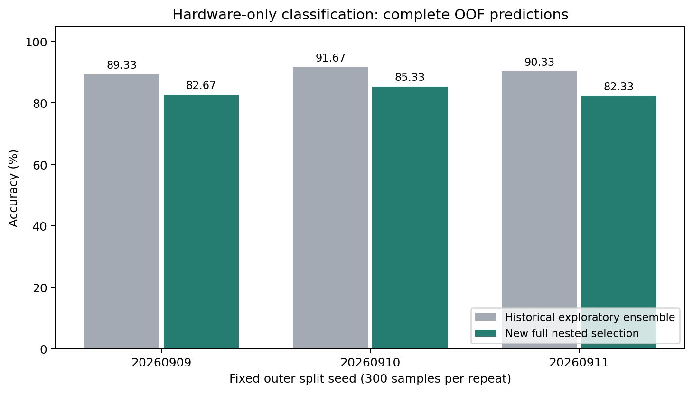
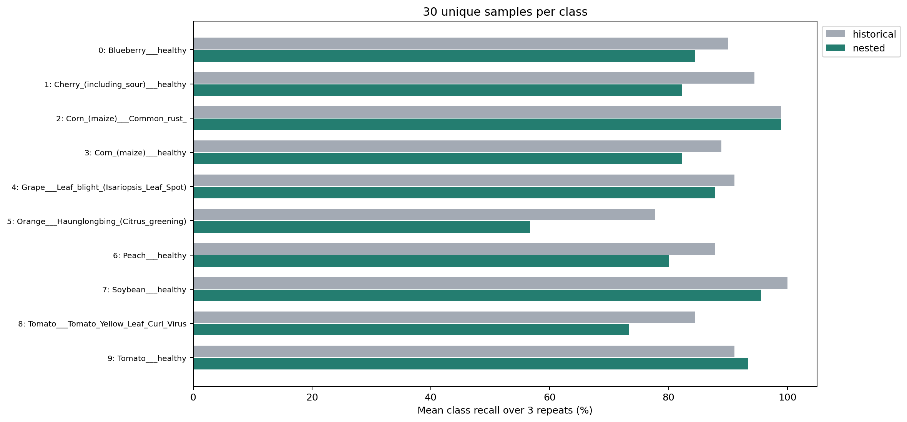
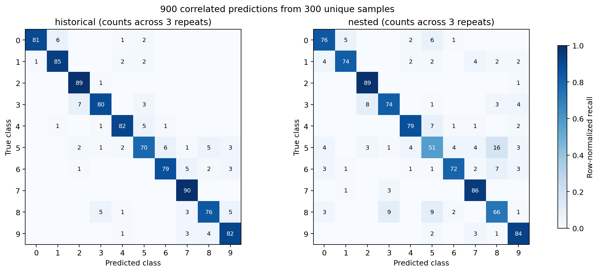
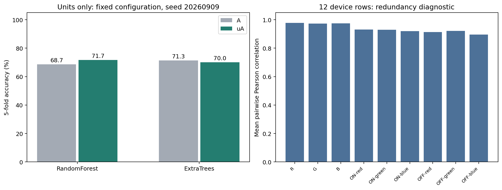

# 九路真实硬件十分类：300 样本优化结果

**结论：未确认超过历史 90.44% 平均准确率。** 新流程三次完整嵌套验证平均准确率 **83.44%**，重复间样本标准差 **1.64 个百分点**；历史探索结果为 **90.44%**，差值 **-7.00 个百分点**。

这里只使用九路实测电流响应，不使用原始 RGB/事件输入作为分类特征。每张为 9 通道 × 12 器件行 × (64 响应点 + tail)，共 7020 维；300 张、每类 30 张。

## 完整验证结果

| 外层划分种子 | 历史准确率 | 新嵌套准确率 | 新宏 F1 | 修正/退步样本数 |
|---|---:|---:|---:|---:|
| 20260909 | 89.33% | 82.67% | 82.27% | 11 / 31 |
| 20260910 | 91.67% | 85.33% | 85.07% | 6 / 25 |
| 20260911 | 90.33% | 82.33% | 82.37% | 8 / 32 |

历史模型已经在同一批数据上筛过 201 组配置；其嵌套复核仅涉及融合权重。新流程把特征、模型、参数与融合权重都纳入外层训练集内的三折选择。两者共享外层划分，但选择流程严格程度不同；历史成绩不能视为未参与选择的独立基线。

每次评估 300 张，三次共 900 次相关预测，不是 900 个独立样本。标准差反映三次划分差异，不是独立测试置信区间。数据已参与此前探索，新的嵌套验证也不能将它变为独立测试集。未提供采集批次/时间信息，当前分层划分不能证明跨批次泛化。

## 诊断与方法

- 输入、硬件响应和历史预测的样本编号、标签与路径逐一核对；没有完全重复的响应样本或非有限电流值。
- 正式训练统一用微安；单位对照只改变单位，保持特征、参数和划分不变。该对照不是模型选择后的正式成绩，且不能证明历史实现存在同一单位问题。
- 12 行响应高度相关，因此比较完整响应、均值/标准差、中位数、状态补偿和蛇形空间池化。tail 独立保留，不跨 tail 做等间隔差分。
- 六个模型族各 6 个固定候选，共 36 个；种子 20260922。任何标准化、PCA、模型拟合和融合权重选择均不使用外层留出标签。
- 硬件输入仍为 RGB+ON+OFF 九路。新增统计或空间特征是电流响应的软件后处理，不是额外传感通道。

## 文件与使用

- [每次重复的指标](repeat_metrics.csv)、[逐类指标](per_class_metrics.csv)、[混淆矩阵长表](confusion_matrix_long.csv)、[配对改善/退步计数](paired_changes.csv)。
- [单位对照](unit_diagnostic.csv)、[十五个外层折的选择](fold_selections.csv)、[冻结搜索协议](search_protocol.json)、[完整汇总](summary.json)。
- [数据审计和原文件 SHA-256](audit.json)、[全数据交付模型的配置](delivery_model.json)。所有准确率是 0–1 比例；混淆矩阵行为真实类、列为预测类。
- [本次运行依赖版本](requirements-reproduce.txt)，Python 版本见冻结协议。重算结果时使用同一环境；新版本依赖的 smoke 通过不等于数值完全一致。
- [持续误判样本的响应质量分组统计](error_diagnostics.json)。逐样本的配对变化和质量诊断仅保存在本地，统计差异不等于器件故障或标签错误。
- `figures/` 同时提供 PNG 和可编辑 SVG。逐类表中的 `prediction_count=90` 表示每类 30 张重复评估三次。

交付模型在全部 300 张上重新做内层选择并训练：`ExtraTrees_05`，权重 `[1.0]`。这一全数据模型没有独立测试成绩，其内层分数不替代上面的外层结果。模型、原文件、完整逐样本预测和稳定误判清单保存在本地 `artifacts_hardware300/`，不推送公开仓库。

运行方法见 [硬件训练说明](../../rc/HARDWARE300.md)。

## 下一步

优先安排新的、混排采集且记录批次的独立实测样本。固定交付模型后再测试；不要反复更换划分种子、删除难样本或挑最高单次成绩。若需要进一步开发特征或扩大搜索，应作为新一轮探索另行记录，不能覆盖本轮冻结协议。

本轮没有确认提升，不建议用该新交付模型替换已有历史融合方案。保留新模型用于复现和后续研究，同时保留历史 90.44% 的原始证据与其探索性限制。
