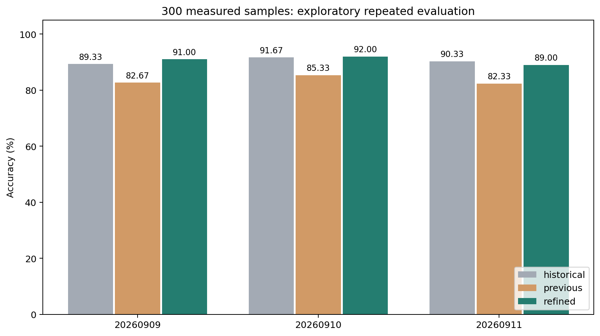
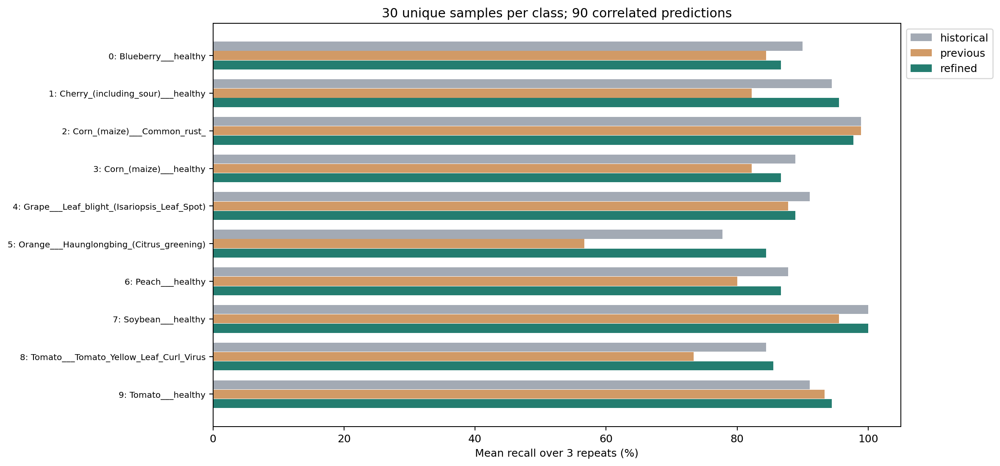
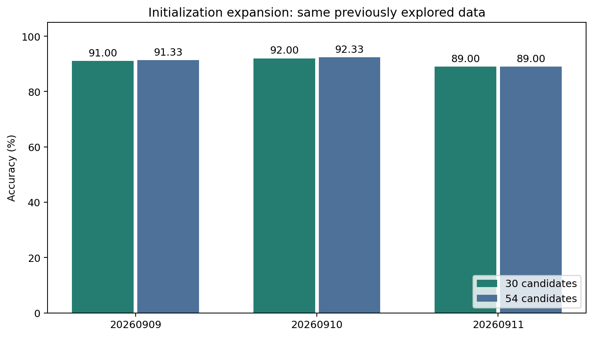

# 九路硬件第二轮：分布特征与神经网络／树模型融合

三次五折平均准确率 **90.67%**，重复间样本标准差 **1.53 个百分点**，宏 F1 **90.67%**。相比第一轮 83.44%，变化 **+7.22 个百分点**；相比历史探索 90.44%，变化 **+0.22 个百分点**。

补充的 54 候选初始化扩展平均为 **90.89%**，完整结果见下方初始化扩展实验；两套结果均保留。

**性质：同一批 300 张上的后续探索，不是独立测试，也不是完全嵌套的无偏性能估计。** 特征和候选先在原种子 20260909 第一外层折以外的 240 张上进行了两阶段三折筛选（51＋38＝89 配置），再冻结 30 个候选。该 240 张会出现在其它外层验证折；虽然每个折内部重新拟合和选择，开发阶段仍已间接使用部分外层标签。所有开发尝试一并保留，不只列出成功配置。

三个重复均使用全部 300 张，每类 30 张，未删难样本、重筛类别或换种子。900 是相关预测次数。输入始终只有九路实测电流；原始 RGB/ON/OFF 文件只用于对齐审计。

| 种子 | 历史探索 | 第一轮 | 第二轮 | 第二轮宏 F1 |
|---|---:|---:|---:|---:|
| 20260909 | 89.33% | 82.67% | 91.00% | 91.10% |
| 20260910 | 91.67% | 85.33% | 92.00% | 91.97% |
| 20260911 | 90.33% | 82.33% | 89.00% | 88.95% |

## 改了什么

- 增加每个通道、每行器件的 18 项响应分布统计；补偿只作用于前 64 点，tail 单独保留。
- 神经网络采用 StandardScaler → PCA → L-BFGS；在训练折内部拟合，并比较正则化、PCA 白化和激活函数。
- 多尺度表示结合原响应统计、补偿响应统计、相对通道响应及蛇形 4×4 池化；它们都是电流的后处理。
- 在每个外层训练集内，按三折预测选取神经网络和树模型前 1/3/5 名，并选择融合比例。外层标签不进入本折拟合或权重选择。

## 文件

- [重复指标](repeat_metrics.csv)、[配对变化](paired_changes.csv)、[逐类召回](per_class_recall.csv)、[混淆矩阵](confusion_matrices.json)。
- [所有开发尝试](development_scores.csv)、[冻结协议](search_protocol.json)、[外层折模型选择](fold_selections.csv)、[完整汇总](summary.json)。
- [全数据模型配置](delivery_model.json) 在全部 300 张上再次做内层选择；其内层分数不是独立测试成绩。
- 原始文件、完整预测与模型只留在本地 `artifacts_hardware300_v2/`。
- [复现命令及特征定义](../../rc/HARDWARE_REFINEMENT.md)；运行环境完整版本在冻结协议中。

要确认真实泛化提升，需固定该模型后评估新采集、带批次标识的硬件样本。本轮只能支持对当前已探索数据的比较。

## 初始化扩展实验（单独保留）

在第二轮结果出来后，又对六个神经网络配置各增加四个初始化种子，在同一个 240 张开发子集上比较。随后冻结 30＋24＝54 个候选，重新完成全部三次五折。它是进一步自适应探索，不能视为对第二轮的独立复核；扩大搜索空间也可能增加选择偏差。

扩展后均值 **90.89%**，重复间标准差 **1.71 个百分点**；相比 30 候选版本变化 **+0.22 个百分点**。

| 种子 | 30 候选版本 | 54 候选初始化扩展 |
|---|---:|---:|
| 20260909 | 91.00% | 91.33% |
| 20260910 | 92.00% | 92.33% |
| 20260911 | 89.00% | 89.00% |

[完整扩展指标](seed_expansion_summary.json)、[重复指标 CSV](seed_repeat_metrics.csv)、[逐类召回](seed_per_class_recall.csv)、[冻结协议](seed_expansion_protocol.json)、[24 个开发配置成绩](seed_development_scores.json)。

初始化扩展没有降低三个划分之间的准确率波动；不能据此声称稳定性改善。与历史方案的微小均值差异也不能证明独立泛化提升。

[初始化扩展的全数据模型配置](seed_delivery_model.json)；本地模型在 `artifacts_hardware300_v2/seed_run/model.joblib`，同样没有独立测试成绩。
